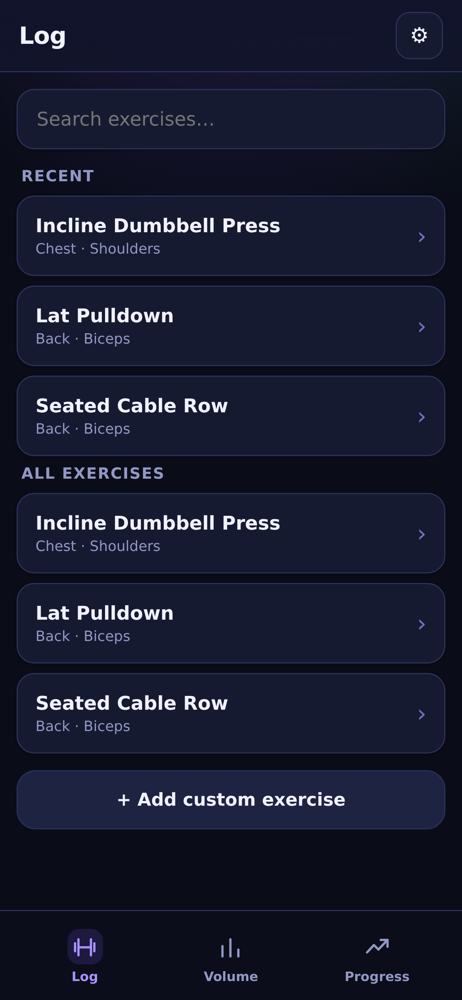
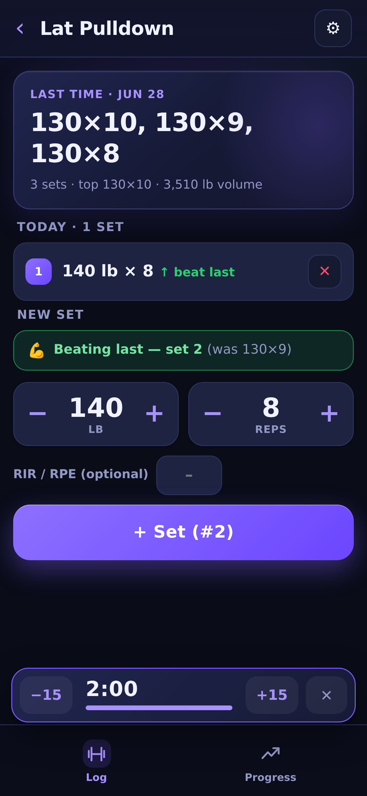
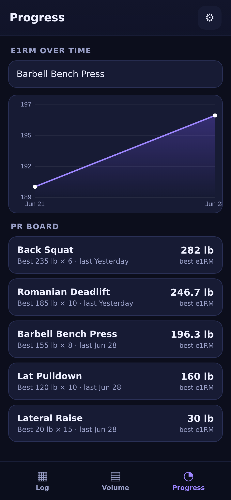

# Gym Log

A personal **hypertrophy gym-logging** web app for iPhone. The whole point: log your
sets at the gym so that **next time you do an exercise, the app instantly shows what you
did last time** — what weight and reps to hit (and beat).

No accounts. No backend. No paid services. Works **offline** from the home screen.
Your data stays on your device.

The same site also ships **Slow Is the Point** (`run.html`) — a 16-week run/walk plan to a
first 5K with a session timer. It installs as its own home-screen app, side by side with
Gym Log. Same rules: offline, no account, data on the device.

<p align="center">
  
  
  
</p>

## The core loop (frictionless logging)

1. Tap an exercise → the **Last time** card shows your previous session up top
   (e.g. `130×10, 130×9, 130×8` with the date).
2. The next set is **pre-filled** with last session's weight and reps, and a
   **beat-last-time** line tells you the set to beat — it turns **green** the moment
   today's set beats it.
3. Tap **+ Set** to log it. Three sets ≈ three taps, zero typing in the common case.
   A **rest timer** auto-starts after each set (adjustable, or off in Settings).
4. Adjust with **steppers** (±5 lb / ±2.5 kg weight, ±1 rep) or tap a number to type.
   RIR/RPE is optional.

## Features

- **Log** tab — the fast logging loop above, with beat-last-time feedback, a "beat last"
  badge on sets that topped last time, and an auto **rest timer** that glows down
  violet → amber → green and pulses when you're ready. Tap a logged set to edit it inline,
  or **swipe it left to delete**.
- **Exercise picker** shows each lift's **last weight** as a chip and when you last did it,
  so you can scan your routine fast.
- **History** — tap the **Last time** card to see every past session for that exercise,
  with a mini chart (heaviest weight or session volume).
- **Progress** tab — **PR board** (heaviest set + best single-session volume, last
  performed) and a per-exercise line chart that toggles between **heaviest weight** and
  **session volume** over time.
- **Installs like a native app** — proper iOS home-screen icon and **launch screens**
  (no white flash on open), full-screen standalone, works offline.
- Starts with a single exercise (**Lat Pulldown**); add, rename, and delete your own from
  the picker or **Settings → Add custom exercise**. No muscle tagging to fuss with.
- **lb** by default, with a **kg** toggle in Settings; configurable rest duration.
- Dark, phone-first UI with large tap targets; designed for one-handed use.

## Slow Is the Point (`run.html`)

A 16-week run/walk progression to a continuous 30 minutes, built around the fact that
lungs adapt in weeks while tendons take months — so it grows running volume slowly and
never makes the jump that ends most Couch-to-5K attempts.

- **Today** — the next session and one Start button. That's the whole home screen.
- **Session timer** — full-screen, colour-coded run/walk, voice and vibration cues, a
  three-beep countdown into each change, and Now Playing controls on the lock screen.
- **Resume** — if iOS suspends the tab mid-run, the app offers to pick up at the second
  it stopped (held six hours; runs under 20 seconds are ignored).
- **Sound & alerts** — two modes, because on iOS they are genuinely exclusive.
  *Keep my music* (default) never claims the audio session: no silent keep-alive
  track, no Now Playing metadata, and `navigator.audioSession.type = "transient"`
  where supported, so a cue ducks Spotify for a moment instead of stopping it.
  *Alert in background* claims it deliberately, so cues land while you are in
  another app — and iOS pauses Spotify for the length of a session. Optional
  notifications cover the first mode when the app is off screen.
- **One-tap logging** with undo, or tap any numbered box in **Plan** to log by hand.
- **Why** — the reasoning and the sources behind the progression.

Progress is `localStorage` plus `navigator.storage.persist()`, with Export/Restore JSON
on the Today tab — the same data-safety model as Gym Log, and the way across to a new
phone. There are no external requests: two variable fonts (Archivo, Martian Mono) are
subset and served from `fonts/`, precached by the service worker, so the app renders
identically with no signal. No libraries, nothing fetched at runtime.

**Look.** The design is a chronograph. The Today dial carries 48 ticks — one per
session, grouped in threes with a gap between weeks, so the ring is countable as weeks
rather than a bare percentage. The timer is the same instrument running: the outer ring
lays out the whole session with each segment's arc as long as it lasts, the inner ring
drains over the interval you're actually in, and a hairline playhead sweeps the session.
The timer panel pins its own dark tokens in both themes — a white screen at dawn is
hostile, and inheriting light-theme ink onto a hardcoded dark ground is how that breaks.
Numerals are Archivo at width 125%; labels are Martian Mono. Motion (entrance stagger,
tick draw-in, number roll-up) is gated on `prefers-reduced-motion`.

A hosted-on-claude.ai copy also exists as an artifact. It syncs to a Claude account but
needs a connection to open, so `run.html` is the one to use for actual runs. If you edit
one, port the change to the other — they are parallel copies, not a shared source.

## Data safety (important)

There's no server, so everything lives in your browser's local storage. iOS can clear
web-app storage under storage pressure, so:

- The app asks iOS for **persistent storage** automatically.
- **Settings → Export backup (JSON)** saves a file (keep it in Files/iCloud).
- **Settings → Restore from JSON** brings it back on any device.
- You'll get a periodic reminder banner to back up.

This is the accepted tradeoff for free + no login. Back up every week or two.

## Deploy (drag onto free static hosting)

It's a static site — host the folder anywhere (Netlify Drop, GitHub Pages, Cloudflare
Pages, etc.). Must be served over **HTTPS** for the service worker / offline to work.

Files that must ship together:

```
index.html                          Gym Log
run.html                            Slow Is the Point (running)
sw.js                               caches both apps for offline
manifest.webmanifest  run.webmanifest
icon-180.png  icon-192.png  icon-512.png
run-icon-180.png  run-icon-192.png  run-icon-512.png
splash/  run-splash/                (iOS launch-screen images)
```

(`docs/` and `tools/` are not needed at runtime. Regenerate icons + splash with
`node tools/generate-icons.js` and `node tools/generate-run-icons.js`.)

### Netlify Drop (easiest)
1. Go to <https://app.netlify.com/drop>.
2. Drag the project folder in. You get an HTTPS URL.

### GitHub Pages
1. Push this repo, then **Settings → Pages → Deploy from branch** (root).
2. Open the published `https://…/index.html`.

### Add to iPhone home screen
Do this once per app — they install separately and get their own icons.

1. Open the HTTPS URL in **Safari** (`/index.html` for Gym Log, `/run.html` for the
   running plan).
2. **Share → Add to Home Screen**.
3. Launch it once while online so the service worker caches everything — after that it
   **runs fully offline** at the gym or on the road.

## Local preview

Any static server works, e.g.:

```sh
python3 -m http.server 8000
# then open http://localhost:8000 (use your machine's LAN IP from the phone)
```

## Tech notes

- Single self-contained `index.html` (vanilla JS, no frameworks, no external requests).
- `sw.js` service worker provides reliable offline caching on iOS (cache-first app shell).
- `manifest.webmanifest` + Apple meta tags give true standalone home-screen behavior.
- Storage: `localStorage` (persistent), plus `navigator.storage.persist()`.
- The chart is drawn on a `<canvas>` — no chart library, nothing to fetch.

### Regenerate icons
```sh
node tools/generate-icons.js       # Gym Log: dumbbell mark, violet
node tools/generate-run-icons.js   # Slow Is the Point: interval mark, orange
```

### Run the end-to-end test (Playwright)
```sh
node tools/test-app.mjs
```
Drives a real browser through the acceptance test: pick a previously-trained exercise,
see last time within one tap, log today's sets with zero typing, beat-last-time feedback,
rest timer, progress (heaviest/volume) chart, custom exercises, unit toggle, and backup
export.
