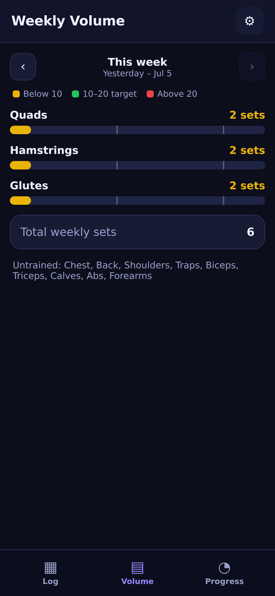

# Gym Log

A personal **hypertrophy gym-logging** web app for iPhone. The whole point: log your
sets at the gym so that **next time you do an exercise, the app instantly shows what you
did last time** — what weight and reps to hit (and beat).

No accounts. No backend. No paid services. Works **offline** from the home screen.
Your data stays on your device.

<p align="center">
  
  
  
</p>

## The core loop (frictionless logging)

1. Tap an exercise → the **Last time** card shows your previous session up top
   (e.g. `155×8, 155×8, 155×7` with the date).
2. The next set is **pre-filled** with last session's weight and reps.
3. Tap **+ Set** to log it. Three sets ≈ three taps, zero typing in the common case.
4. Adjust with **steppers** (±5 lb / ±2.5 kg weight, ±1 rep) or tap a number to type.
   RIR/RPE is optional.

## Features

- **Log** tab — the fast logging loop above. Tap any logged set to edit it inline.
- **Volume** tab — weekly **sets-per-muscle**, color-coded to a 10–20 sets/week target
  band (yellow = below, green = in range, red = above). Each exercise counts 1 set to its
  primary muscle and 0.5 to an optional secondary. Browse previous weeks.
- **Progress** tab — **PR board** (best e1RM, best weight, last performed) and an
  **e1RM-over-time** line chart per exercise.
- Auto-computed **estimated 1RM** per set (Epley: `weight × (1 + reps/30)`).
- **~75 preloaded** common hypertrophy lifts with primary/secondary muscle mappings.
  Add and edit your own from **Settings**.
- **lb** by default, with a **kg** toggle in Settings.
- Dark, phone-first UI with large tap targets; designed for one-handed use.

## Data safety (important)

There's no server, so everything lives in your browser's local storage. iOS can clear
web-app storage under storage pressure, so:

- The app asks iOS for **persistent storage** automatically.
- **Settings → Export backup (JSON)** saves a file (keep it in Files/iCloud).
- **Settings → Restore from JSON** brings it back on any device.
- You'll get a periodic reminder banner to back up.

This is the accepted tradeoff for free + no login. Back up every week or two.

## Deploy (drag onto free static hosting)

It's a static site — host the folder anywhere (Netlify Drop, GitHub Pages, Cloudflare
Pages, etc.). Must be served over **HTTPS** for the service worker / offline to work.

Files that must ship together:

```
index.html
sw.js
manifest.webmanifest
icon-180.png  icon-192.png  icon-512.png
```

(`docs/` and `tools/` are not needed at runtime.)

### Netlify Drop (easiest)
1. Go to <https://app.netlify.com/drop>.
2. Drag the project folder in. You get an HTTPS URL.

### GitHub Pages
1. Push this repo, then **Settings → Pages → Deploy from branch** (root).
2. Open the published `https://…/index.html`.

### Add to iPhone home screen
1. Open the HTTPS URL in **Safari**.
2. **Share → Add to Home Screen**.
3. Launch it once while online so the service worker caches everything — after that it
   **runs fully offline** at the gym.

## Local preview

Any static server works, e.g.:

```sh
python3 -m http.server 8000
# then open http://localhost:8000 (use your machine's LAN IP from the phone)
```

## Tech notes

- Single self-contained `index.html` (vanilla JS, no frameworks, no external requests).
- `sw.js` service worker provides reliable offline caching on iOS (cache-first app shell).
- `manifest.webmanifest` + Apple meta tags give true standalone home-screen behavior.
- Storage: `localStorage` (persistent), plus `navigator.storage.persist()`.
- The chart is drawn on a `<canvas>` — no chart library, nothing to fetch.

### Regenerate icons
```sh
node tools/generate-icons.js
```

### Run the end-to-end test (Playwright)
```sh
node tools/test-app.mjs
```
Drives a real browser through the acceptance test: pick a previously-trained exercise,
see last time within one tap, log today's sets with zero typing, plus volume, progress,
unit toggle, and backup export.
